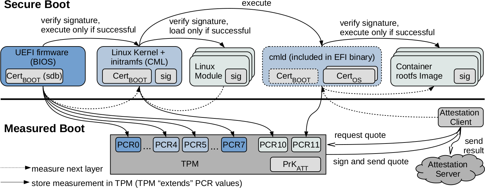

# GyroidOS Secure Boot

 

 

To protect the code integrity, GyroidOS performs a conventional Secure Boot procedure.
The secure boot of GyroidOS is based directly on it's own keys and the Linux kernel is directly started from the UEFI-BIOS without any intermediate bootloader such as _shim_ or _grub2_.
This reduces the complexity of the boot procedure, and it is not necessary to sign and use another bootloader which would in turn verify and start the Linux kernel.
For this reason, all types of keys (see [UEFI keys](#uefi-keys)) are replaced and _CertBOOT_ is stored in sdb, to get full control over the platform. 

The upper part of the Figure above shows the secure boot procedure.
With every start of the system, trustworthy ROM code, the UEFI firmware is executed.
The included public key of _CertBOOT_ is used as root of trust for the
GyroidOS Secure Boot. Note that UEFI directly uses the Public key and does not validate the
certificate nor is it possible to provide certificate chains here.
This key is used to verify the next layer of software by it's hash value when it is being loaded.
In our case the Linux kernel.
The Linux kernel is built as an EFI binary so that it can be started directly by the UEFI-BIOS without another bootloader.
The kernel itself also includes the _CertBOOT_ to verify its modules before
loading a module. The _cmld_ (Container Manager Daemon) as part of the _initramfs_ is already
verified by the initial verification process of the UEFI. The _cmld_ starts the next
stage a container, and thus verifies the container rootfs image before execution of the
corresponding container.

In principal a TPM is not necessary for Secure Boot.
The lower part of the figure shows a "Measured Boot" procedure which is described in [Measured Boot](/architecture/measured_boot).

In a nutshell to enable secure boot, during build the following steps are performed:

* Translating the Kernel to EFI (from ELF)
* Integrating the initial ramdisk (initramfs) into the kernel-binary
* Use _efitools_ to generate KEK, PK and "Signature Database Keys"
* Signing of the Kernel with the private key _PrKBOOT_, and storing the corresponding public key in form of a certificate _CertBOOT_ as a "Signature Database Key" (sbsign)
* Signing the kernel modules with the same private key _PrKBOOT_
* Integrating _CertBOOT_ into the kernel-binary to verify the modules
* Lock-Down with _efitools_ for the rollout of the _efivars_ keys

The signing process is described in [PKI](/pki).

At the system start, no UEFI-password is set.
It would however be possible to set a UEFI-password, to protect the UEFI-configuration.
This means to stop an attacker from modifying the UEFI-configuration by entering the UEFI-menu at the start of the system.
With this the attacker could only disrupt the availability of the system.
The changing of the UEFI parameters causes the Secure Boot to fail, which means the system will not start.
If the attacker disables Secure Boot, the availability is also prevented, because the key for the persistent storage encryption is bound to PCR 7 in the TPM as described in [Storage Encryption](/architecture/storage_encryption).
PCR 7 stores wether or not Secure Boot is active.
Only if PCR 7 receives the correct values, the TPM will release the key to the persistent storage encryption,
and only then the system can be started.

During first boot of the system, GyroidOS is started in a so called _provisioning mode_.
This mode is a base installation which is used to configure the system and only contains the core container _core0_.
The user has access to _core0_ and can use it to load a signed GuestOS and a signed container configuration file onto the device.
Further during provisioning it is allowed to deploy CA certificates for own GuestOS images.
To conduct these steps, _core0_ offers a control interface with an extended command scope.
As soon as the provisioning is completed, the provisioning mode is exited through an irreversible command and the scope of the command interface is reduced permanently, e.g., no further certifictaes for GuestOS image verification
can be registered.

### UEFI keys
Three types of keys exist in the context of the UEFI specification:

* <b> Platform Key (PK). </b> The PK shall be under the control of the "Platform Owner", meaning the buyer/owner of the hardware.
Setting the PK shifts the platform to the secure "User/Secure Mode".
UEFI-BIOS usually offers the possibility to switch to "Setup-Mode".
The OS can activate "Secure Mode" at the first boot after the key has been updated

* <b> Key-Exchange Key (KEK). </b> KEKs represent publice and private key pairs, which are standardly controlled by the OS vendor, since it owns the private keys.
The "Platform Owner" however can determine which public key they install in their system.

* <b> Signature Database. </b> Hashes, signatures or public signature keys for the verification of software components can be stored in the "Signature Database".
Corresponding private keys are used to sign binaries.
All binaries that are signed with a "Signature Database" key can also be started in "Secure Mode".

* <b> Forbidden Signature Database. </b> By storing forbidden hashes in the "Forbidden Signature Database" downgrade and replay attacks can be prevented.

