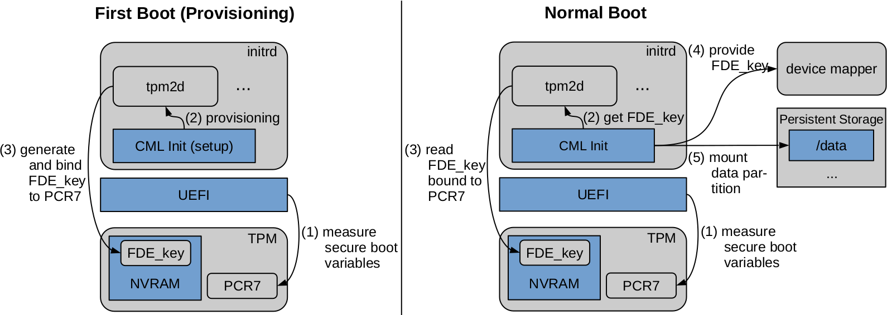

# Storage Encryption

GyroidOS provides two layers of encryption. First the full disk encryption
for overall persistent data of the container management layer (CML) itself.
Second for each compartment with an individual container specific key.

## CML Storage Encryption

Persistent data, especially sensitive user data of the containers or the virtualization layer should be encrypted.
The integrity of the kernel and initial-ramdisk is assured by secure boot but they are not encrypted, since they contain only code and no sensitive data.
All other persistent data of the virtualization layer including the container images are encrypted via Full Disk Encryption (FDE).
The key for this KFDE is protected by the TPM. 
For this, the KFDE is saved in Non-Volatile Random-Acess Memory (NVRAM) of the TPM and its release is bound to the state of the platform (similar to the Windows Bitlocker technology).
The TPM only releases the key, if the system can attest the correct values during the "Measured Boot".
The key is used directly by the Linux Kernel for the FDE (it could also be used to decrypt a Linux Unified Key Setup (LUKS) for example).
No password is necessary, therefore the decryption is coupled to the state of the platform and not the user.

### Implementation for the KFDE

 

 

On the left side, the figure above shows how the KFDE (FDE\_key) is created and bound to the TPM. 
At first boot, the encryption is initialized in the CML init script of the initial-ramdisk.
For this it uses the _tpm2d_ daemon.
This daemon is responsible for the whole communication with the TPM in GyroidOS.
The daemon creates a key called FDE\_key, saves it in the NVRAM of the TPM and binds it to the state of the platform, which is saved in the Platform Control Register (PCR) 7.

As shown on the right side of the figure above, every start of the system following the first boot, the state of the platform is measured by the "Measured Boot". 
After this, the container manager module of the virtualization layer uses the _tpm2d_ to read the FDE\_key from the TPM's NVRAM.
This is only possible, if the expected value has previously been written to PCR 7.
After reading the key successfully, the CML init script passes it on to the device mapper, which is responsible for the transparent de- and encryption of persistent memory.
Therefore, the CML init script can mount the data partition and proceed with starting the _cmld_ (container manager daemon).

## Container Storage Encryption

Additionally to system-wide persistent data encryption, the persistent data of a container is encrypted with a separate container individual key KCFDE.
When the container first gets instantiated, the Compartment Manager creates a random key KCFDE.
Analogous to the system-wide encryption this key is given to the device mapper, which is responsible for the transparent de- and encryption of persistent memory.
AES-XTS is combined with HMAC via dm-integrity for AEAD encryption of the persistent data.
The KCFDE is a 768 bit long key, which consists of 512 bit for the AES-XTS and 256 bit for the HMAC key.

KCFDE itself is encrypted either with another key encryption key the KKEK and a Key-Wrapping procedure defined in RFC 3394 and it is only saved encrypted either in a per container softtoken or Secure Element.
The procedure protects the confidentiality and the integrity of the wrapped KCFDE.
GyroidOS supports the [SmartCard-HSM](https://www.smartcard-hsm.com) in form of a USB-Token.

